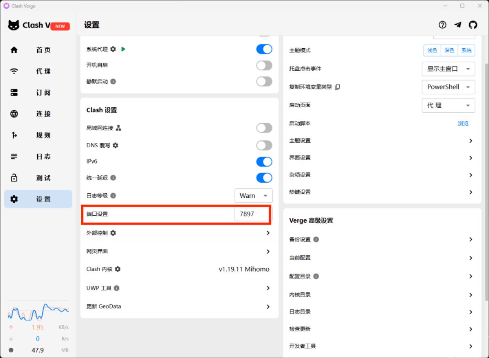
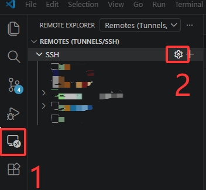
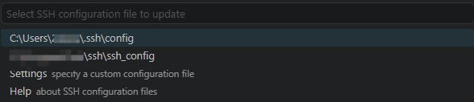
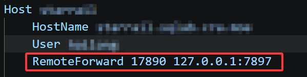
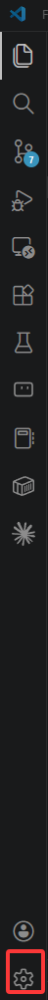
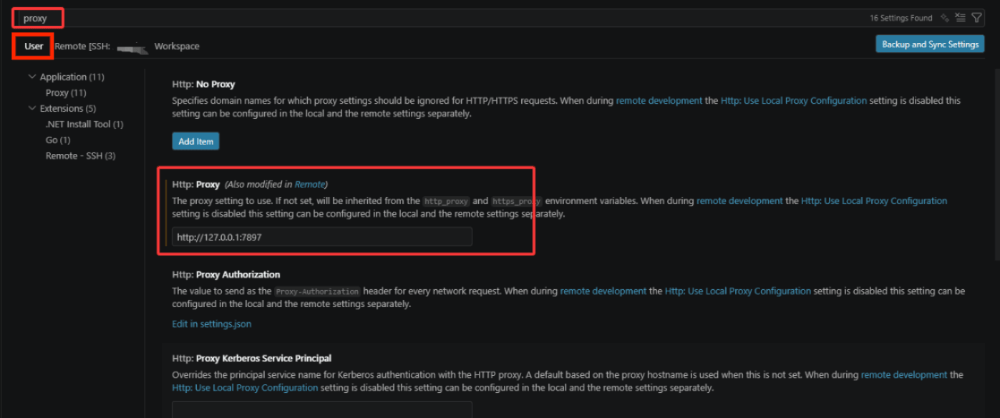
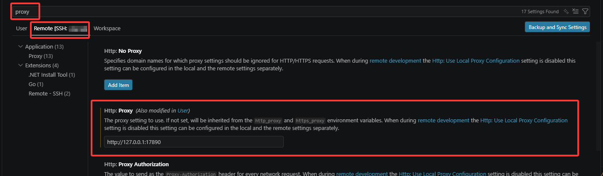

# 在远程服务器上配置codex

codex在远程登陆时候需要走远程服务器的网络，所以需要搭建一条隧道，让远程服务器的网络配置可以走本地代理。

## 1. 看自己代理的端口

我们首先需要看我们本地的代理到底走的是哪一个端口，首先打开自己的代理软件，这里以clash为例：

我们可以看到我们代理端走的是7897端口，也有很多默认是7890端口。总之先把这个端口号记住。

## 2.配置一下你的转发端口

这一步主要是让服务器的网络请求自动转发到我们的本机上来。这里我们需要首先找到我们的ssh配置文件在哪里。如果你用的是vscode，那么你可以根据下面这张图的两个按钮自动走到你的ssh配置文件当中去。第一个按钮是让你走到ssh插件页面，第二个按钮是让你走到ssh配置文件里。

这个时候一般会出来如下弹窗，让你选择到底是哪一个ssh文件，我们一般选择用户目录下的ssh文件，也就是 **第一条** 。

进去之后找到你要使用codex插件的那个服务器的配置，一般就是看Host以及HostName来辨认我们要修改的服务器配置，前者是你自己起的名字，后者为服务器的域名或者ip地址。

我们需要在我们要改的Host下面加一个  **RemoteForward** 配置，如我上述图中锁写的。前面这个17890是随便写的，最好不要写7890和7897这种和你本机一样的数字，也不要写太小的数字，我这个17890一般就可以，防止和服务器端的别的服务端口发生碰撞。后面这个 **127.0.0.1:7897** 是你本机的代理服务端口号， **127.0.0.1** 表示的是你自己的本机ip，7897是我们上一步看的clash客户端中的代理端口。这里要根据你第一步看到的那个代理端口去修改。切勿盲目复制粘贴我这个7897端口，因为你的可能是类似7890这样别的端口。

这一步的配置的目的是把服务器端17890端口的访问，自动转发到我们本机的7897端口上。接下来我们需要让服务器端的http访问走17890端口，而不是默认的端口。

## 3.配置服务器和本地的http代理

点开 vscode的配置页面，一般在侧边栏的最下面

点开之后点 `Settings`，或者你也可以用快捷键 `Ctrl + ,`，也可以快速进入配置文件。

进入配置文件后我们先修改 `User`的配置（搜索栏下面你可以看到有一个User，一个Remote），我们先在上方的搜索栏搜 `proxy`, 然后我们可以看到下面这一条。

我们需要在 `http proxy` 配置里面把我们之前确定的本地的代理服务器端口给配置进去。同时前面要加 `http`,也就是我们红框里面的 `http://127.0.0.1:7897` ,注意这里是本地端口啊，要跟我们之前**RemoteForward**配置里面的后面对应上，同时也就和我们的clash客户端对应上了。

紧接着我们再去配置Remote的`http proxy`。先点一下那个Remote，然后同样是搜索 `proxy`

这里的配置和前面几乎都相同，除了最后一个端口，这个端口是我们之前 **RemoteForward** 配置里面前面输入的服务器端的端口，我之前的设置是17890，所以这里也是17890，前面的都一样。所以最终的结果是 `http://127.0.0.1:17890`。

## 4.最后一步，重载窗口

所有的你都已经配置完了，接下来你要做的就是把窗口关掉重新开。让配置生效。当然你有一个快速的方法。

按住 `Ctrl + Shift + P`, 会出来一个弹窗，在弹窗里面搜 **reload** ，然后第一条就有一个 `Develop: Reload Window` ，点击这一条，你就自动重载了当前的窗口，你的新配置也就生效了。然后你就可以按照你之前的操作去登录codex和使用codex了。注意代理一定要开啊。

## 注意事项

选择梯子节点的时候尽量选择美国节点，亲测美国节点更稳一些，其他节点都可能会出现不稳定的现象。如果在登录时出现了抱歉请重试，可以试试换换节点重新登录，或者等一会再重新登录，一般几次之后都会好。
